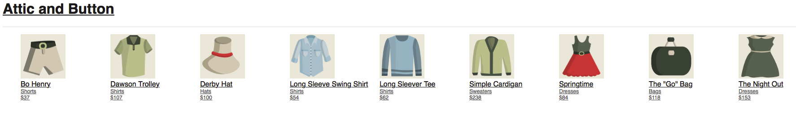

# Optimizely Isomorphic React Web App Demo SDK Tutorial

This tutorial enables you to quickly get started in your development efforts to create a React/Redux-based webpage with the Optimizely Isomorphic React Web App Demo. This demo package includes an interactive project that contains two experiments. The first experiment illustrates how an online retailer could use a Variation to sort the items to be rendered by price or name. The second experiment shows how a Variation can be used to select between a one-screen or two-screen checkout process.



This demo node web app uses the Optimizely Node SDK and JavaScript SDK for A/B Testing. The isomorphic web app is built using React/Redux. All React components are shared between the server and client, and can be rendered both on the server side and the frontend.

The demo works as follows:
* Configuration starts by setting up a project, feature, and event in the Optimizely dashboard, which will be queried by the demo web page using the Optimizely JavaScript API.
* The demo consists of a website that is run on a local server listening on Port 4242. The site's assets are included in the web page via a [webpack](https://webpack.js.org) bundle.
* The renderer for the web page is defined in **./src/client/index.js**.
* The code to create an Optimizely Client instance is defined in **/src/client/optimizely_manager.js**.
* As the main web page is rendered, the list of products and the names of their associated images are read from **./src/common/server/services/items.js**. The view handler defined in **./src/server/routes/views.js** activates the *sorting* experiment and sorts the items according to price or name, depending on the Variation returned.
* When the user clicks one of the products, the Demo App redirects the browser to a product-specific route consisting of `/pdp/<item.id>`. This is configured in the `render` function defined in **./public/main.js:**
* When the user clicks the **Add to cart** button on the product-specific page, the **cart** page is displayed and the cart addition event is tracked by Optimizely. During this process the Demo App uses the `getCheckoutFlow` function defined in **./src/common/action_creators/index.js** to set the URL for either a one-screen or two-screen checkout process.
* When the user clicks the **Checkout** button on the **cart** page, the browser is redirected either to the checkout page for the one-step checkout, or to the shipping details page for two-step checkout.
* When the user clicks **Next** on the shipping page for the two-step checkout, the browser is redirected to the billing page, where credit card details can be entered.
* When the user clicks **Complete Checkout** on the billing page, the *checkout flow* experient is activated by Optimizely and the browser is redirected back to the main web page. Optimizely also tracks the checkout flow event.

The following sequence diagram illustrates the flow:


**Note**: The experimentation logic is not instrumented in the React components themselves. Instead, the experiment variations are determined before computing the application state, and are used to vary that state to reflect the experiments being run. The experimentation logic runs in the Redux code inside the `action_creators`. The Demo App also stores the experiment data in a Redux store so the React components can access the experiment data and render accordingly.

## Prerequisites
* [Optimizely account](https://app.optimizely.com/signin)
* [npm](https://www.npmjs.com/get-npm)
* [Node v4.0.0 or higher](https://nodejs.org/en/blog/release/v4.0.0/) 

## Quick start
This section shows you how to prepare the project in the Optimizely portal and run the demo in a browser hosted by a local server.

### Preparing an Optimizely Project
This section describes the steps to prepare an Optimizely project in your dashboard.

1. Clone or download the **isomorphic-react-demo-app** package.
2. Log in or create an [Optimizely Account](https://app.optimizely.com/signin).
3. Create a project via the Optimizely dashboard.
4. Open **./src/common/utils/enums.js**, replace the value for `PROJECT_ID` with the ID from your project in the Optimizely dashboard, and save the file.
5. Add an Experiment called `sorting_experiment`.
6. Add two feature variations to the `sorting_experiment`: name them `sort_by_price` and `sort_by_name`.
7. Add one event to the `sorting_experiment`: `add_to_cart`. This event tracks when a user adds a product to a cart.
8. Add a second Experiment called `checkout_flow_experiment`.
9. Add two feature variations to the `checkout_flow_experiment`: name them `one_step_checkout` and `two_step_checkout`.
10. Add an Event Key called `checkout_complete` and save the event. This event tracks when a user clicks the **Complete Checkout** button.


### Running the Server and Demo

1. Open a terminal window and navigate to the root of the **isomorphic-react-demo-app** package.
2. Install the dependencies:
```shell
npm install
```
3. Build the assets. This builds **main.js** into the public directory:
```shell
webpack
```
4. Run the server:
```shell
npm start
```
Once the server is executing, the output should indicate that it's running on port 4242.
4. Open a browser and enter `http://localhost:4242` as the URL. The demo webpage should display.

## How the Test App was Created
The following subsections provide information about key aspects of the demo and how it was designed:
* [Project Structure](#project-structure)
* [SDK Packaging](#sdk-packaging)
* [Visual Assets](#user-interface-and-visual-assets)
* [Styling](#styling)

### Package Structure
The following are the main components in the package:

1. **./src/client/**: contains all client-side code.
2. **./src/server/**: contains all server-side code.
3. **./src/common/**: contains code common to both the client and server.
4. **./src/server/routes/views.js**: computes the application state using Optimizely Experiment data and uses it to hydrate the React components on the server-side.
5. **./src/common/action_creators/index.js**: tracks events on the client side.
6. **./src/common/components/cart/index.js**: activates the `checkout_flow` experiment on the client-side. 
7. **./src/common/utils/enums.js**: specifies the keys used for the Optimizely project.
8. **./node_modules**: contains the node.js dependencies. 
9. **./webpack.config.js**: contains configuration information describing how the package is [bundled](#sdk-packacking). 
10. **./src/server/services/page_template.js**: contains the HTML for the main web page.

### SDK Packaging
The website is bundled with the site's resources using [webpack](https://webpack.js.org). webpack bundles the source code, dependencies, application and experimentation logic into a single bundle and is configured using the webpack configuration file: **./webpack.config.js**. For this package, three [babel](https://babeljs.io/) packages are bundled for the client side:
```javascript
var path = require('path');
var webpack = require('webpack');

module.exports = {
  module: {
    loaders: [
      {
        test: /\.js$/,
        exclude: /node_modules/,
        loader: 'babel', // 'babel-loader' is also a legal name to reference
        query: {
          presets: ['babel-preset-es2015', 'babel-preset-react', 'babel-preset-stage-2']
        }
      }
    ]
  },
  plugins: [
    new webpack.optimize.DedupePlugin(),
  ],
  entry: './src/client/index.js',
  output: {
    filename: 'main.js',
    path: './public'
  }
}

```

### Visual Assets
**./src/server/services/items.js** contains the list of products to sell on the demo website. For each product, the file provides the name, color, category, price and the name of a .png image file to display. The image files are located in **./public/**:

|Asset                   |Description                                                                                        |
|------------------------|---------------------------------------------------------------------------------------------------|
|`item_1.png`            |Contains an image of a hat.|
|`item_2.png`            |Contains an image of a pair of shorts.|
|`item_3.png`            |Contains an image of a bag.|
|`item_4.png`            |Contains an image of a dress.|
|`item_5.png`            |Contains an image of a dress.|
|`item_6.png`            |Contains an image of a shirt.|
|`item_7.png`            |Contains an image of a shirt.|
|`item_8.png`            |Contains an image of a shirt.|
|`item_9.png`            |Contains an image of a sweater.|

### Styling
The web page template (**page_template.js**) references a basic CSS located in **./public/app.css**.

## User Interface and Functionality
* [Main Page](#main_page)
* [Item Page](#item_page)
* [Cart Page](#cart_page)
* [Completing the Checkout](#completing_the_checkout)

## Main Page
The `viewHandler` function in **./src/server/routes/views.js** activates the sorting experiment:

```javascript
const viewHandler = function(request, reply) {
  ...

  // Activate the user for the sorting experiment
  optimizelyManager.getInstance()
    .then((optimizelyInstance) => {
      const variation = optimizelyInstance.activate(enums.EXPERIMENT_KEYS.SORTING_EXPERIMENT, user.key)

      // Use the variation key to determine the property we are sorting on
      const sortBy = variation === enums.VARIATION_KEYS.SORT_BY_PRICE ? 'price' : 'name'
      const data = itemService.getItems(sortBy)
```

The handler then matches the routes using the react router, which determines the component to render based on the route. An initial state is created, and later modified if the user is on the checkout page. The HTML is then generated by invoking `renderFullPage`:
```javascript
match(
  {
    routes: reactRoutes,
    location,
  },
  (err, redirectLocation, renderProps) => {
    if (err) {
      console.log(err);
    }

    if (renderProps) {
      // Compile an initial state for our store so we can render on the server side
      const preloadedState = {
        currentUserId: user.key,
        optimizelyExperimentData: {},
        items: data,
      }

      // conditionally activate the checkout flow experiment if the user is in the checkout page
      if (location === enums.ROUTES.CHECKOUT) {
        const checkoutFlowVariation = optimizelyInstance.activate(enums.EXPERIMENT_KEYS.CHECKOUT_FLOW_EXPERIMENT, user)
        preloadedState.optimizelyExperimentData[enums.EXPERIMENT_KEYS.CHECKOUT_FLOW_EXPERIMENT] = checkoutFlowVariation
      }

      ...

      // Render React App with the rest of the HTML body
      const fullHtml = renderFullPage(
        {
          datafile: optimizelyManager.getDatafile(),
          html,
          preloadedState,
          variation,
        }
      )

      ...
    }
  }
)
```

The base web page is defined in **./src/server/services/page_template.js**, and the JavaScript used by that page is defined in **./public/optimizely.min.js**. It defines the `renderFullPage` function which is invoked by the view. The function starts by creating an Optimizely Client instance:
```javascript
export const renderFullPage = (data) => {
  return `
    <!doctype html>
    <html>
    ...
      <body>
        <div id="app">${data.html}</div>
        <script>
          window.__OPTIMIZELY_DATAFILE__ = ${JSON.stringify(data.datafile)}
          window.__PRELOADED_STATE__ = ${JSON.stringify(data.preloadedState).replace(/</g, '\\x3c')}
          var optimizely = window.optimizelyClient.createInstance({datafile: window.__OPTIMIZELY_DATAFILE__});
          ...
```

The function then retrieves the variation for `sorting_experiment`:
```javascript
export const renderFullPage = (data) => {
  return `
          ...
          optimizely.getVariation("sorting_experiment", window.__PRELOADED_STATE__.currentUserId)
        </script>
        <script src="/public/main.js"></script>
      </body>
    </html>
  `
}
```

## Item Page
When the user clicks an item on the main page, the `render` function defined in **./src/common/components/pdp/index.js** is invoked to generate the HTML to render the item on its own page. This HTML creates a button entitled **Add to Cart** and sets up an `onClick` handler:
```javascript
render() {
  const item = this.props.item
  return (
      ...
      <div style={ {'font-family': 'sans-serif'} }>
        ...
        <button
          className="button cta-btn"
          onClick={ this.addToCart.bind(this) }>
          Add to cart
        </button>
      </div>
    </div>
  )
}
```

When **Add to Cart** is clicked, the `addToCart` function defined in **./src/common/action_creators/index.js** is invoked. `addToCart` invokes `track` to track that an item has been added to the cart:
```javascript
export function addToCart(item) {
  return function(dispatch, getState) {
    const userId = getState().currentUserId

    optimizelyManager.getInstance()
      .then((optimizelyInstance) => {
        optimizelyInstance.track(enums.EVENT_KEYS.ADD_TO_CART, userId)
        dispatch(addToCartSuccess(item))
      })
  }
}
```

The browser then redirects to the **Cart** page.


## Cart Page
During the redirection to the **Cart** page, the `componentDidMount` function defined in **./src/common/components/cart/index.js** invokes the `getCheckFlow` defined in **./src/common/action_creators/index.js**:
```javascript
componentDidMount() {
  this.props.getCheckoutFlow()
}
```

`getCheckoutFlow` retrieves the Variation for the checkout flow Experiment:
```javascript
export function getCheckoutFlow() {
  return function(dispatch, getState) {
    ...
    optimizelyManager.getInstance()
      .then((optimizelyInstance) => {
        const checkoutFlowVariation = optimizelyInstance.getVariation(
          enums.EXPERIMENT_KEYS.CHECKOUT_FLOW_EXPERIMENT,
          userId
        )
        ...
      })
  }
}
```

The `render` function for the cart page is then invoked to generate the HTML for the checkout page. The function starts by checking the variation obtained to determine if the checkout flow should consist of one or two screens, and sets the 'Link' element accordingly for the **Checkout** button:
```javascsript
render() {
  // determine whether to show one step or two step checkout when the user clicks on the checkout button
  const checkoutLink =
    this.props.checkoutFlow === enums.VARIATION_KEYS.TWO_STEP_CHECKOUT ?
    '/checkout/shipping' : '/checkout'
  ...

  return (
    <div>
        ...
        <div className="cart-summary-column">
            ...
            <div className="push-double--top">
              <Link to={ checkoutLink }>
                <button className="cta-btn button">Checkout</button>
              </Link>
            </div>
    ...
```

## Completing the Checkout
In both the one-step and two-step checkout cases, the user completes the checkout by clicking a button entitled **Complete Checkout**. In both cases, the `completeCheckout` function defined in **./src/common/action_creators/index.js** is invoked and calls `track` to track the checkout completion event:
```javascript
export function completeCheckout() {
  return function(dispatch, getState) {
    const userId = getState().currentUserId
    return new Promise((resolve, reject) => {
      ...

      optimizelyManager.getInstance()
        .then((optimizelyInstance) => {
          optimizelyInstance.track(enums.EVENT_KEYS.CHECKOUT_COMPLETE, userId, null, checkoutTotal * 100)
          dispatch(completeCheckoutSuccess())
          resolve()
        })
    })
  }
}
```

After the user completes the checkout process, the browser navigates back to the main product page.


## Additional Resources
* Developer Docs: https://developers.optimizely.com/x/solutions/sdks/.
* Questions? Shoot us an email at developers@optimizely.com.
